# 智能投标系统 — 开发进度与产品规划对照

> 更新时间: 2026-04-14 17:28

---

## 一、已完成功能清单

### 1. 核心管线（已上线）

| 功能 | 状态 | 说明 | 提交 |
|------|------|------|------|
| 📄 招标文件解析 (python-docx) | ✅ 完成 | 支持 .docx，提取段落+表格+标题层级 | `1600152` |
| 🤖 AI 两轮分析 (Pass 1 + Pass 2) | ✅ 完成 | Pass1 深度分析 → Pass2 生成大纲 | `d247849` |
| ✅ Pass 3 校验 | ✅ 完成 | 确定性校验：废标/评分/文件覆盖率 | `f3f4307` |
| 🔍 BGE 语义检索 (Self-RAG) | ✅ 完成 | bge-small-zh-v1.5 本地向量索引 | `4f80a4f` |
| 📝 逐章节 AI 生成 | ✅ 完成 | 选择性生成，实时进度 | `1600152` |
| 📥 docx 输出下载 | ✅ 完成 | 自动组装 Word 文件 | `1600152` |
| 🎨 章节类型智能分类 | ✅ 完成 | BGE embedding 分类 + LLM 辅助 | `4f80a4f` |

### 2. 4/2-4/7 会话新增/增强

| 功能 | 状态 | 说明 | 提交 |
|------|------|------|------|
| 🏆 评分深度提取 (含表格) | ✅ 完成 | 表格渲染为 Markdown 注入 LLM | `8e7a39a` |
| 🔴 废标项深度提取 | ✅ 完成 | 独立提取废标章节+表格 | `8e7a39a` |
| 🔗 评分/废标 → 章节联动 | ✅ 完成 | section_linkage 正向索引 | `8e7a39a` |
| 📡 SSE 实时进度推送 | ✅ 完成 | asyncio.Queue + progress_callback | `8e7a39a` |
| 🌊 Qwen 流式调用 | ✅ 完成 | 替换 generate→stream，实时显示 AI 输出 | |
| 🔄 Pass 1 重试机制 | ✅ 完成 | 自动重试 1 次，3 秒间隔 | `8e7a39a` |
| 📊 分值校验 (score_warnings) | ✅ 完成 | 子项分值求和 vs 大项总分校验 | `8e7a39a` |
| 🖥️ 前端联动展示 | ✅ 完成 | 左侧大纲 + 右侧卡片显示评分/废标 | `8e7a39a` |

### 3. 4/7-4/14 会话新增/增强

| 功能 | 状态 | 说明 |
|------|------|------|
| 🗑 任务删除 API | ✅ 完成 | DELETE /tasks/{id} 5步清理 + 幽灵任务兼容 |
| 📝 历史任务管理页 | ✅ 完成 | TaskHistory.jsx 删除+缓存+下载 |
| 🎨 前端体验升级 | ✅ 完成 | 全文预览+章节管理+素材徽标 |
| 🔍 图片 OCR 增强 | ✅ 完成 | 证书图片自动 OCR + 缓存复用 |
| 🏅 资质去重修复 | ✅ 完成 | name\|\|holder 组合键，同名证书不再覆盖 |
| 🏢 资质分类 | ✅ 完成 | cert_type: personal/company 自动标注 |
| 🔗 简历-证书关联 | ✅ 完成 | resume.certifications 自动关联 |
| 🏷️ 前端证书标签 | ✅ 完成 | 简历行🏅标签 + 资质行👤/🏢分类 |
| 📊 日志可观测性 | ✅ 完成 | 全局中间件 + 端点级日志 |

### 3. 测试验证结果 (8.31.docx)

```
Pass 1 results: 21 required docs, 6 rejection conditions, 3 evaluation criteria
Pass 2 results: 21 sections, 11 with rejection risk
Pass 3 verification: rejection 6/6 ✅, evaluation 3/3 ✅, documents 21/21 ✅
Section linkage: 7 sections linked to scoring/rejection items
Section type classifier corrected 1 types
Extraction complete: 2 volumes, 21 sections
```

---

## 二、产品功能模块总览

```mermaid
graph TB
    subgraph "当前已实现"
        A[📄 招标文件上传] --> B[🔍 文档解析]
        B --> C[🤖 AI 分析<br/>Pass1 深度分析<br/>Pass2 大纲生成<br/>Pass3 校验联动]
        C --> D[📊 结构确认<br/>评分/废标联动展示]
        D --> E[📝 逐章节生成]
        E --> F[📥 Word 下载]
        
        G[📚 素材库管理] --> G1[上传/导入]
        G --> G2[人员/项目/资质]
        G --> G3[Diff 审核]
    end
    
    subgraph "开发中 / 待做"
        H[🎯 素材智能注入<br/>MaterialMatcher]
        I[📈 报价策略分析]
        J[🔄 多版本对比]
        K[👥 协同编辑]
    end
    
    C -.-> H
    G -.-> H
    H -.-> E
    
    style A fill:#2d5016
    style B fill:#2d5016
    style C fill:#2d5016
    style D fill:#2d5016
    style E fill:#2d5016
    style F fill:#2d5016
    style G fill:#2d5016
    style G1 fill:#2d5016
    style G2 fill:#2d5016
    style G3 fill:#2d5016
    style H fill:#7c4a03
    style I fill:#4a1c1c
    style J fill:#4a1c1c
    style K fill:#4a1c1c
```



---

## 三、后续开发计划

### P0 — 近期优先

| # | 功能 | 说明 | 状态 |
|---|------|------|------|
| 1 | **素材智能注入** | MaterialMatcher 4 步策略 | ✅ 已完成 |
| 2 | **生成质量提升** | 数据驱动章节生成策略 | 🔥 下一步 |
| 3 | **资质分类+简历关联** | cert_type + resume.certifications | ✅ 已完成 |

### P1 — 短期 (1-2 周)

| # | 功能 | 说明 | 预估 |
|---|------|------|------|
| 4 | **素材确认界面** | 匹配结果人工确认 UI | 1-2 天 |
| 5 | **多招标文件格式** | 支持 .pdf（OCR）、.doc（转换） | 2 天 |
| 6 | **架构重构** | bidding.py 拆分为 BiddingOrchestrator | 2-3 天 |
| 7 | **前端 UI 优化** | 评分详情弹窗、废标条件高亮、进度动画 | 1-2 天 |

### P2 — 中期 (2-4 周)

| # | 功能 | 说明 | 预估 |
|---|------|------|------|
| 8 | **报价策略** | 基于历史中标数据分析合理报价区间 | 3-5 天 |
| 9 | **协同编辑** | 多人在线编辑投标文件，实时同步 | 5-7 天 |
| 10 | **版本管理** | 投标文件多版本对比和回滚 | 2-3 天 |
| 11 | **模板库** | 常用投标文件模板，一键套用 | 2-3 天 |

---

## 四、技术架构概要

```
数据流: 
  招标文件(.docx)
    → tender_parsing (python-docx, 表格提取)
    → requirement_extraction (3-Pass: 分析→结构→校验)
      ├─ Pass 1: Qwen 流式分析 (废标+评分+资质)
      ├─ Pass 2: Qwen 流式生成大纲
      └─ Pass 3: 确定性校验 + section_linkage
    → content_generation (逐章节, Self-RAG 增强)
    → docx_assembly (Word 输出)

前端: React + Vite (5173) → 后端: FastAPI + uvicorn (8001)
LLM: Qwen-Max (DashScope API)
Embedding: BAAI/bge-small-zh-v1.5 (本地)
```

---

## 五、关键代码位置

| 模块 | 路径 |
|------|------|
| 后端入口 | [main.py](file:///Users/mason/Desktop/code%20/angenimi-agentic/lawfirmAGplat/agentic_on_arch/app/main.py) |
| 投标 API | [bidding.py](file:///Users/mason/Desktop/code%20/angenimi-agentic/lawfirmAGplat/agentic_on_arch/app/api/bidding.py) |
| 需求提取 | [requirement_extraction.py](file:///Users/mason/Desktop/code%20/angenimi-agentic/lawfirmAGplat/agentic_on_arch/app/core/skills/builtin/requirement_extraction.py) |
| 文档解析 | [tender_parsing.py](file:///Users/mason/Desktop/code%20/angenimi-agentic/lawfirmAGplat/agentic_on_arch/app/core/skills/builtin/tender_parsing.py) |
| Qwen LLM | [qwen.py](file:///Users/mason/Desktop/code%20/angenimi-agentic/lawfirmAGplat/agentic_on_arch/app/core/llm/qwen.py) |
| 前端投标页 | [BiddingAgent.jsx](file:///Users/mason/Desktop/code%20/angenimi-agentic/lawfirmAGplat/platform/src/agents/BiddingAgent.jsx) |
| 素材面板 | [MaterialPanel.jsx](file:///Users/mason/Desktop/code%20/angenimi-agentic/lawfirmAGplat/platform/src/agents/MaterialPanel.jsx) |
